<!-- Generated by generate.py — edit HEADLINE / PROFILE there and run: python generate.py -->

  <picture>
    <source media="(prefers-color-scheme: dark)" srcset="./dark.svg">
    <source media="(prefers-color-scheme: light)" srcset="./light.svg">
    
  </picture>

  <b>End-to-End Software Engineer</b> 
  Open to FDE · SDE · Full-Stack roles &nbsp;·&nbsp; I like building software that solves real-world problems.

  <a href="https://me-portfolio-flax.vercel.app/"><picture><source media="(prefers-color-scheme: dark)" srcset="./assets/nav-portfolio-dark.svg"><source media="(prefers-color-scheme: light)" srcset="./assets/nav-portfolio-light.svg"></picture></a>
  <a href="#projects"><picture><source media="(prefers-color-scheme: dark)" srcset="./assets/nav-projects-dark.svg"><source media="(prefers-color-scheme: light)" srcset="./assets/nav-projects-light.svg"></picture></a>
  <a href="#stack"><picture><source media="(prefers-color-scheme: dark)" srcset="./assets/nav-stack-dark.svg"><source media="(prefers-color-scheme: light)" srcset="./assets/nav-stack-light.svg"></picture></a>
  <a href="#writing"><picture><source media="(prefers-color-scheme: dark)" srcset="./assets/nav-writing-dark.svg"><source media="(prefers-color-scheme: light)" srcset="./assets/nav-writing-light.svg"></picture></a>
  <a href="#contact"><picture><source media="(prefers-color-scheme: dark)" srcset="./assets/nav-contact-dark.svg"><source media="(prefers-color-scheme: light)" srcset="./assets/nav-contact-light.svg"></picture></a>

<picture><source media="(prefers-color-scheme: dark)" srcset="./assets/section-about-dark.svg"><source media="(prefers-color-scheme: light)" srcset="./assets/section-about-light.svg"></picture>

<picture><source media="(prefers-color-scheme: dark)" srcset="./assets/about-dark.svg"><source media="(prefers-color-scheme: light)" srcset="./assets/about-light.svg"></picture>

<picture><source media="(prefers-color-scheme: dark)" srcset="./assets/section-projects-dark.svg"><source media="(prefers-color-scheme: light)" srcset="./assets/section-projects-light.svg"></picture>

  <a href="https://github.com/abdullah-habeeb/renewly-subscription-tracker"><picture><source media="(prefers-color-scheme: dark)" srcset="./assets/project-renewly-dark.svg"><source media="(prefers-color-scheme: light)" srcset="./assets/project-renewly-light.svg"></picture></a>
   <a href="https://subscription-hub-19cf9.web.app"><b>Live demo →</b></a> &nbsp;·&nbsp; <a href="https://github.com/abdullah-habeeb/renewly-subscription-tracker"><b>Repository →</b></a>

  <a href="https://github.com/abdullah-habeeb/Rule-Based-Auto-Remediation-For-Windows"><picture><source media="(prefers-color-scheme: dark)" srcset="./assets/project-remediation-dark.svg"><source media="(prefers-color-scheme: light)" srcset="./assets/project-remediation-light.svg"></picture></a>
   <a href="https://github.com/abdullah-habeeb/Rule-Based-Auto-Remediation-For-Windows"><b>Repository →</b></a>

  <a href="https://github.com/abdullah-habeeb/iot-defense"><picture><source media="(prefers-color-scheme: dark)" srcset="./assets/project-iot-dark.svg"><source media="(prefers-color-scheme: light)" srcset="./assets/project-iot-light.svg"></picture></a>
   <a href="https://github.com/abdullah-habeeb/iot-defense"><b>Repository →</b></a>

<picture><source media="(prefers-color-scheme: dark)" srcset="./assets/section-stack-dark.svg"><source media="(prefers-color-scheme: light)" srcset="./assets/section-stack-light.svg"></picture>

<picture><source media="(prefers-color-scheme: dark)" srcset="./assets/stack-dark.svg"><source media="(prefers-color-scheme: light)" srcset="./assets/stack-light.svg"></picture>

<picture><source media="(prefers-color-scheme: dark)" srcset="./assets/section-writing-dark.svg"><source media="(prefers-color-scheme: light)" srcset="./assets/section-writing-light.svg"></picture>

<a href="https://itzabada.substack.com/"><picture><source media="(prefers-color-scheme: dark)" srcset="./assets/writing-dark.svg"><source media="(prefers-color-scheme: light)" srcset="./assets/writing-light.svg"></picture></a>

<picture><source media="(prefers-color-scheme: dark)" srcset="./assets/section-activity-dark.svg"><source media="(prefers-color-scheme: light)" srcset="./assets/section-activity-light.svg"></picture>

  <picture><source media="(prefers-color-scheme: dark)" srcset="https://github-profile-summary-cards.vercel.app/api/cards/stats?username=abdullah-habeeb&theme=tokyonight"></picture>
  <picture><source media="(prefers-color-scheme: dark)" srcset="https://github-profile-summary-cards.vercel.app/api/cards/most-commit-language?username=abdullah-habeeb&theme=tokyonight"></picture>

  
✨ Random dev quote

   
  

    <picture><source media="(prefers-color-scheme: dark)" srcset="https://quotes-github-readme.vercel.app/api?type=horizontal&theme=dark"></picture>
  

<picture><source media="(prefers-color-scheme: dark)" srcset="./assets/section-contact-dark.svg"><source media="(prefers-color-scheme: light)" srcset="./assets/section-contact-light.svg"></picture>

  <a href="https://me-portfolio-flax.vercel.app/"><picture><source media="(prefers-color-scheme: dark)" srcset="./assets/contact-portfolio-dark.svg"><source media="(prefers-color-scheme: light)" srcset="./assets/contact-portfolio-light.svg"></picture></a>
  <a href="https://www.linkedin.com/in/abdullahhabeeb/"><picture><source media="(prefers-color-scheme: dark)" srcset="./assets/contact-linkedin-dark.svg"><source media="(prefers-color-scheme: light)" srcset="./assets/contact-linkedin-light.svg"></picture></a>
  <a href="mailto:abdullah01901006@gmail.com"><picture><source media="(prefers-color-scheme: dark)" srcset="./assets/contact-email-dark.svg"><source media="(prefers-color-scheme: light)" srcset="./assets/contact-email-light.svg"></picture></a>
  <a href="https://itzabada.substack.com/"><picture><source media="(prefers-color-scheme: dark)" srcset="./assets/contact-substack-dark.svg"><source media="(prefers-color-scheme: light)" srcset="./assets/contact-substack-light.svg"></picture></a>
  <a href="https://www.instagram.com/yalla.habiibii/"><picture><source media="(prefers-color-scheme: dark)" srcset="./assets/contact-instagram-dark.svg"><source media="(prefers-color-scheme: light)" srcset="./assets/contact-instagram-light.svg"></picture></a>

<picture><source media="(prefers-color-scheme: dark)" srcset="./assets/footer-dark.svg"><source media="(prefers-color-scheme: light)" srcset="./assets/footer-light.svg"></picture>

